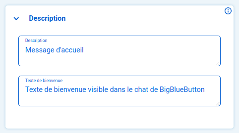
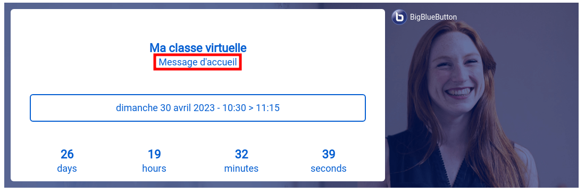
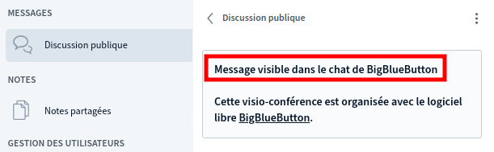
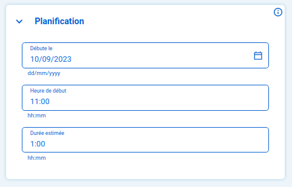
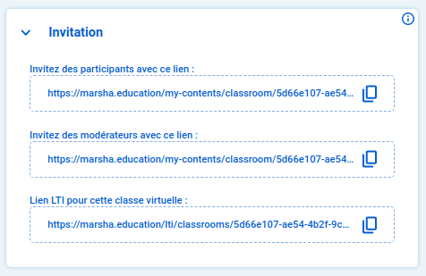
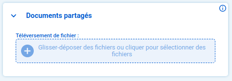
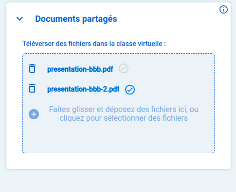
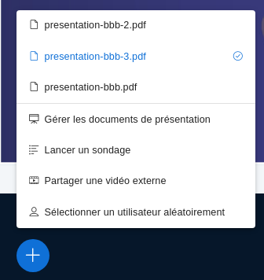
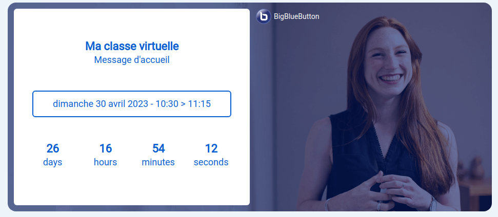

# 🎛 2. Configurer la classe virtuelle


Cette étape concerne l'utilisation de classes virtuelles depuis Moodle en LTI, ainsi que sur le portail national et les plateformes FUN.

* Pour des conseils d'utilisation sur le plugin BBB, rendez-vous sur l'onglet dédié dans la rubrique Créer une classe virtuelle : [Ajouter et paramétrer une nouvelle classe BigBlueButton](creer-votre-classe-virtuelle/depuis-le-moodle-de-votre-etablissement.md#ajouter-et-paramétrer-une-nouvelle-classe-bigbluebutton)
* Pour un guide d'utilisation sur la plateforme Esup-Pod, contactez le service informatique de votre université, rendez-vous sur [Paramétrer et programmer une réunion BBB sur Pod](creer-votre-classe-virtuelle/depuis-la-plateforme-esup-pod.md#paramétrer-et-programmer-une-réunion-bbb-sur-pod)


Une fois la salle créée, un écran de configuration apparaît.


Les composants de configuration (widgets) peuvent s'afficher sur 2 ou 3 colonnes selon la plateforme où vous configurez votre classe virtuelle.


## Titre et lancement

Si vous souhaitez démarrer la classe immédiatement, vous pouvez simplement saisir un titre et cliquer sur `Lancer la classe virtuelle maintenant dans BBB` :

Vous pouvez aussi **planifier et préparer votre classe** à l'aide des widgets suivants.

## Description

Pour saisir des messages d'accueil pour vos participants.

* Le champ **Description** correspond au texte d'affichage sur l'écran d'attente coté LMS .
* Le **Texte de bienvenue** s'affichera au niveau du chat dans BigBlueButton .

## Planification

Pour planifier votre classe virtuelle avec une date et heure de début et durée estimée.

## Invitation

Pour partager votre classe virtuelle.

1. **Lien d'invitation pour les participants :** permet d'inviter des personnes qui ne sont pas inscrite au cours (lien public).
2. **Lien d'invitation pour les modérateurs :** permet d'inviter des personnes qui rejoindront avec des droits de modération équivalent aux vôtres.
3. **Lien d'intégration en LTI :** pour intégrer votre salle dans un autre cours sur le LMS.

## Outils et applications

Pour activer les fonctionnalités suivantes en amont de la classe virtuelle :

* Chat ("Discussion publique" sur BBB)
* Notes partagées
* Salle d'attente (tout le monde entrera sans validation)
* Enregistrement (le bouton **Enregistrer** ne s'affichera pas dans BBB)

## Documents partagés

Pour charger vos présentations **au format PDF** via glisser-déposer ou en sélectionnant votre fichier en local et choisir celle qui doit s'afficher au lancement de la classe.

Sélectionnez la présentation par défaut en cliquant sur la coche à droite :

Les fichiers chargés seront accessibles depuis la classe BigBlueButton : 


Vous pouvez supprimer les fichiers et les télécharger en local en cliquant sur leur titre.


## Enregistrements

Pour récupérer vos enregistrements **au format .mp4** après la classe virtuelle.


* Tous les moments enregistrés au cours d'une session sont proposés dans un seul fichier.
* Vous pourrez enregistrer la session à chaque fois que vous relancer la classe.


Une fois votre classe planifiée, un écran d'attente s'affichera pour les participants (dans le LMS, sur la plateforme de votre choix ou depuis le lien d'invitation) :

Il est temps désormais de voir comment lancer et animer votre classe virtuelle.
