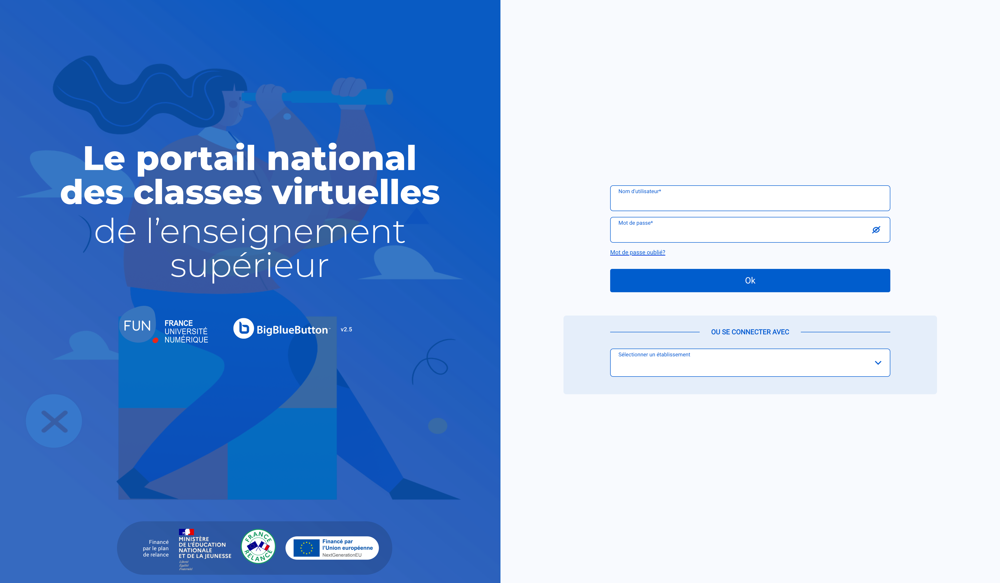
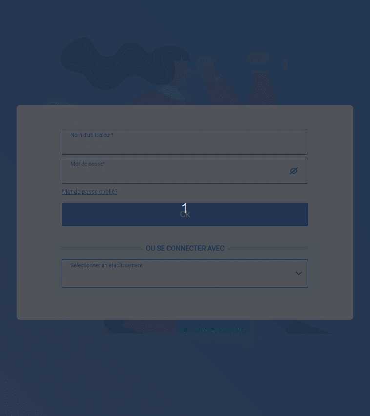
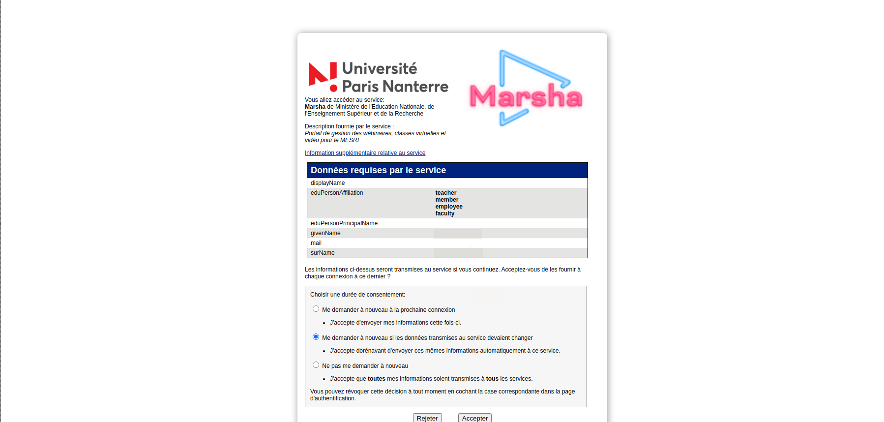
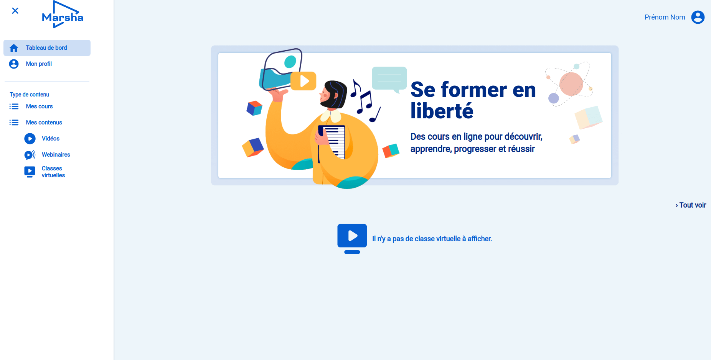
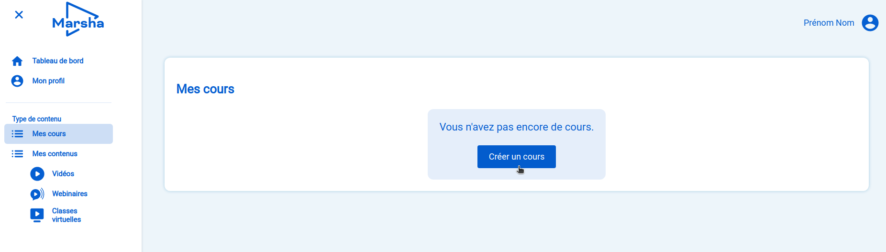
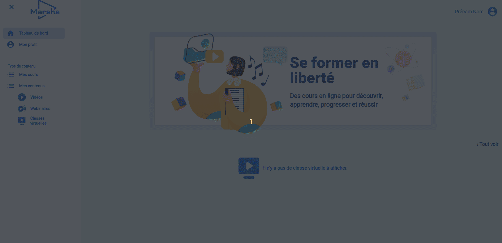
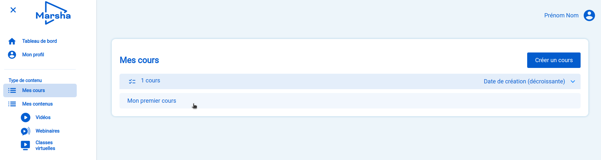
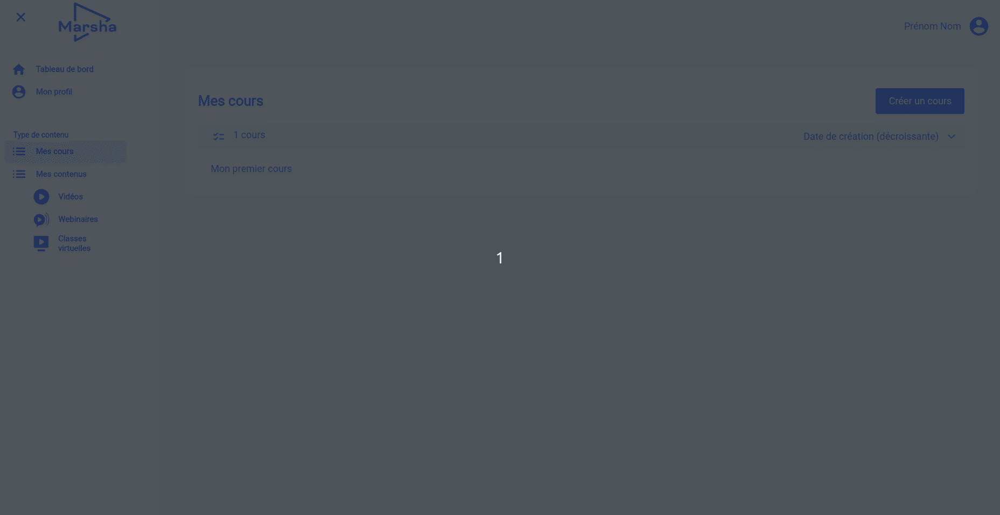
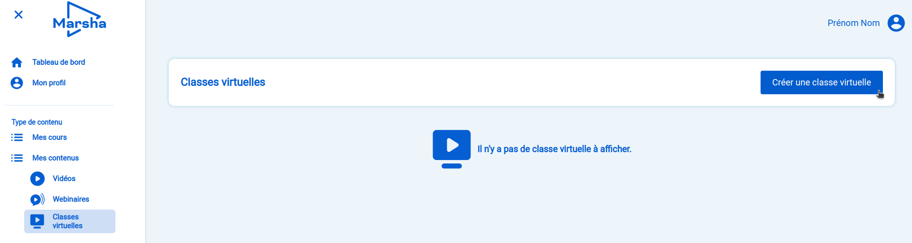
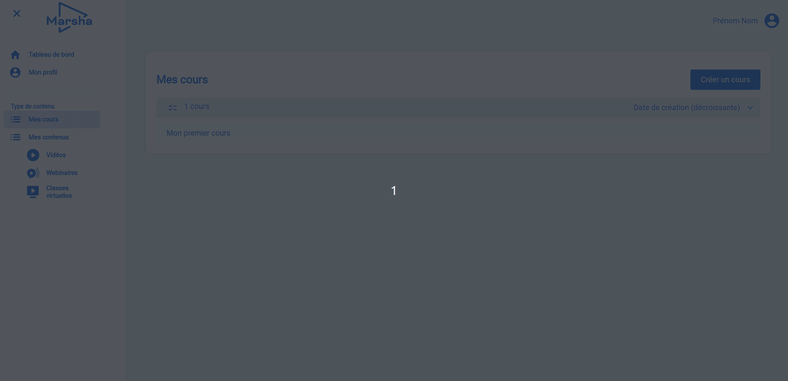

# Depuis le portail national des classes virtuelles

D'abord gestionnaire de vidéos en LTI[^1] pour les plateformes de France Université Numérique (FUN), Marsha[^2] est désormais un portail national de mutualisation de contenus pédagogiques pour l'ESR. Développé dans le cadre du Plan de relance, il vous permet notamment de créer facilement des classes virtuelles BigBlueButton.

En tant qu'enseignant, vous pouvez vous y connecter en utilisant votre identifiant universitaire et :

* préparer en amont votre classe virtuelle et en programmer la date et l’heure ;
* téléverser dans l’application les supports de présentation au format PDF afin qu’ils soient automatiquement disponibles dans la classe virtuelle dès l’ouverture de la classe BBB ;
* générer un lien d‘invitation pour inviter également des participants externes ;
* récupérer l'enregistrement à la fin de la classe virtuelle.

Suivez les étapes suivantes pour créer facilement des classes virtuelles pour vos étudiants.

## I. Connexion au portail national


La portail permet la connexion via la fédération d'identité Shibboleth (RENATER).


1. Rendez-vous sur le portail via l'adresse [https://classe-virtuelle.numerique-esr.fr](https://classe-virtuelle.numerique-esr.fr).

2. Sur la page d'accueil, saisissez le nom de votre établissement dans le menu déroulant.
3. Entrer vos identifiants universitaires sur la page qui s'ouvre.

4. Après la saisie de vos identifiants, il vous sera demandé de donner vos préférences en matière de consentement au transfert des données (listées dans le tableau).

5. Vous avez désormais accès au portail !

## II. Créer votre classe virtuelle

### A. Créer votre premier cours

Avant de pouvoir créer votre première classe virtuelle, il est nécessaire de créer un cours.

Sélectionnez `Mes cours` dans le menu de gauche et cliquez sur `Créer un cours`.


Vous pouvez associer les différentes ressources créées sur ce portail à un **cours**.

En plus des classes virtuelles, vous pouvez dès à présent y charger des vidéos et organisez des webinaires. Prochainement, il vous sera aussi possible d'utiliser d'autres services tels que la création de leçons au format Markdown, l'hébergement et partage de fichiers ou bien la collecte de devoirs d'étudiants.

Les cours fonctionnent comme des **listes de lecture** qui vous permettront d'organiser et de partager ces ressources.


#### Partagez un cours au sein de votre organisation (facultatif)

Lorsque vous créez un cours, le rôle d'Administrateur vous est automatiquement assigné.

Pour partager les ressources d'un cours à des collègues et leur permettre notamment de cogérer vos classes virtuelles, sélectionnez le cours depuis votre page `Mes cours`.

Cliquez sur `Ajouter des utilisateurs` puis saisissez le nom ou l'adresse email d'un membre de votre établissement qui est aussi inscrit sur le portail.

Vous pouvez alors lui attribuer l'un des deux statuts suivants :

* `Administrateur` : pour lui donner les mêmes permissions que vous, à savoir gérer les accès au cours, voir toutes les classes créées dans le cours et y créer et lancer de nouvelles classes.
* `Instructeur` : il ne pourra pas modifier les accès au cours ni voir vos classes virtuelles mais pourra ajouter des classes dans le cours et les utiliser.


La gestion des permissions est en cours d'intégration. Plus d'informations à venir.


### B. Créer votre première classe virtuelle

Une fois votre cours créé, vous allez pouvoir créer votre première classe virtuelle.

1. Sélectionnez `Classes virtuelles` dans le menu de gauche
2. Cliquez sur le bouton `Créer une classe virtuelle`.

Sur cette nouvelle page :

1. Donner un titre à votre classe virtuelle
2. Sélectionner le cours auquel l'associer
3. Ajouter une description qui correspond au message d'accueil pour vos étudiants (facultatif)
4. Cliquer sur le bouton `Ajouter une classe virtuelle`

Vous avez désormais accès au panneau de configuration de votre classe ! :tada:

Rendez-vous à la prochaine étape : [Configurer votre classe virtuelle](../configurer-votre-classe-virtuelle.md)

[^1]: Pour Learning Tools Interoperability. Il s'agit d'une norme d'échange entre outils d'apprentissage.

[^2]: Gestionnaire de contenus pour l'éducation créé par France Université Numérique (FUN).
