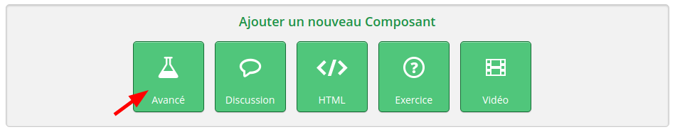
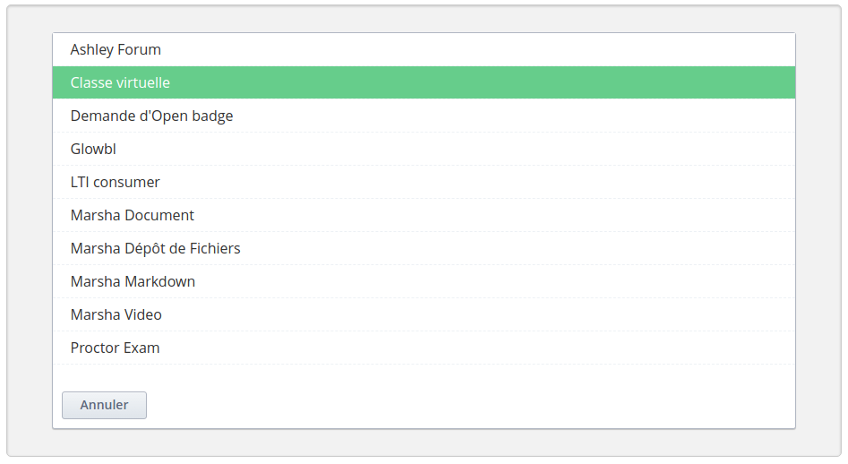

# Depuis les plateformes FUN

En tant que concepteur de cours sur les plateformes FUN, vous devez vous trouver dans l'unité où vous souhaitez ajouter votre classe virtuelle et suivre les étapes suivantes.

Sur votre unité, cliquez sur `Avancé` pour ajouter un composant :

Dans vos composants avancés, choisissez **Classe virtuelle** :

L'interface de configuration de la classe virtuelle va s'ouvrir dans le composant.

Passez à la rubrique suivante pour la configurer !
